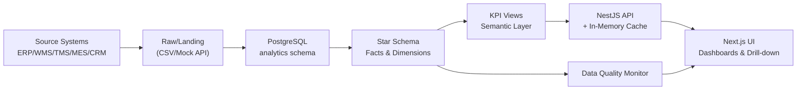

# Architecture — Supply Chain Control Tower

## Overview

Reporting-only analytics platform for supply chain operations. **No write-back** to operational systems.

## Tech Stack

| Layer | Technology | Purpose |
| ----- | ---------- | ------- |
| Frontend | Next.js 14, TypeScript, Tailwind, Recharts, TanStack Query | Dashboard UI |
| Backend | NestJS, TypeScript | Metrics API, auth, audit |
| Database | PostgreSQL 16 | Star schema analytics + app tables |
| Cache | node-cache (in-memory) | API response caching (60s TTL) |
| Auth | NextAuth (placeholder) | OIDC/SAML ready |
| Deployment | Docker Compose | PostgreSQL container |

## Key Design Decisions

1. **Read-only architecture**: No mutations to business data through the API. All endpoints are GET or POST (for complex queries only).

2. **KPI-driven design**: Every chart and tile is driven by the `kpi_catalog` table. The Metrics Service maps KPI IDs to materialized SQL views.

3. **Star schema in PostgreSQL**: 7 dimensions + 6 fact tables with pre-computed KPI views in the `analytics` schema. No ORM — raw SQL for full control over query performance.

4. **Cache-first API**: In-memory cache with 60s TTL for metric queries, 5min for catalog and dimension data. Meets P95 < 500ms target.

5. **Demo data with realistic distributions**: Seed script generates 12 months of data with realistic variance (not flat random) — customers, suppliers, seasonal patterns.

6. **Schema separation**: `analytics` schema for warehouse data, `app` schema for RBAC/audit/catalog. Clean separation of concerns.

## Security Model

- **RBAC**: 5 roles (ADMIN → VIEWER) with permission arrays stored in `app_role.permissions` JSONB
- **RLS**: `user_org_access` table maps users to org nodes. API enforces org scope on all queries
- **Audit**: `audit_log` table captures LOGIN, DASHBOARD_VIEW, EXPORT, QUERY, CONFIG_CHANGE events
- **PII masking**: Column-level masking strategy (planned for Phase 6)

## API Design

Metric-first API pattern:

- `POST /api/metrics/query` accepts `{kpiId, timeRange, filters, limit}`
- The service maps `kpiId` → SQL view → filtered query → cached response
- Same endpoint serves all KPIs; the semantic layer handles the SQL differences
