# Data Model — Star Schema

## ERD Overview

```mermaid
erDiagram
    dim_date ||--o{ fact_orders : "order_date"
    dim_date ||--o{ fact_shipments : "ship_date"
    dim_date ||--o{ fact_inventory_snapshot : "snapshot_date"
    dim_date ||--o{ fact_production : "production_date"
    dim_date ||--o{ fact_purchase_orders : "po_date"
    dim_date ||--o{ fact_forecast : "forecast_date"

    dim_org ||--o{ fact_orders : "org_id"
    dim_org ||--o{ fact_shipments : "org_id"
    dim_org ||--o{ fact_inventory_snapshot : "org_id"
    dim_org ||--o{ fact_production : "org_id"
    dim_org ||--o{ fact_purchase_orders : "org_id"
    dim_org ||--o{ fact_forecast : "org_id"

    dim_product ||--o{ fact_orders : "product_id"
    dim_product ||--o{ fact_inventory_snapshot : "product_id"
    dim_product ||--o{ fact_production : "product_id"
    dim_product ||--o{ fact_purchase_orders : "product_id"
    dim_product ||--o{ fact_forecast : "product_id"

    dim_customer ||--o{ fact_orders : "customer_id"
    dim_supplier ||--o{ fact_purchase_orders : "supplier_id"
    dim_carrier ||--o{ fact_shipments : "carrier_id"
    dim_lane ||--o{ fact_shipments : "lane_id"

    dim_date {
        date date_key PK
        int day_of_week
        int month_num
        int quarter
        int year
        int fiscal_year
    }

    dim_org {
        varchar org_id PK
        varchar org_name
        varchar org_type
        varchar parent_org_id FK
        varchar country
    }

    dim_product {
        varchar product_id PK
        varchar product_name
        varchar product_family
        varchar category
        numeric unit_cost
        numeric unit_price
    }

    dim_customer {
        varchar customer_id PK
        varchar customer_name
        varchar segment
        varchar channel
        varchar country
    }

    dim_supplier {
        varchar supplier_id PK
        varchar supplier_name
        varchar tier
        int lead_time_days
    }

    fact_orders {
        varchar order_line_id PK
        varchar order_id
        date order_date FK
        varchar org_id FK
        varchar customer_id FK
        varchar product_id FK
        numeric ordered_qty
        numeric delivered_qty
        boolean is_otif
    }

    fact_inventory_snapshot {
        varchar snapshot_id PK
        date snapshot_date FK
        varchar org_id FK
        varchar product_id FK
        numeric on_hand_qty
        numeric days_on_hand
        varchar age_bucket
    }

    fact_production {
        varchar production_id PK
        date production_date FK
        varchar org_id FK
        varchar product_id FK
        numeric planned_qty
        numeric actual_qty
        numeric schedule_adherence
        numeric capacity_utilization
    }
```

## Dimension Tables (7)

| Table | Grain | Key Columns | Size (seed) |
| ----- | ----- | ----------- | ----------- |
| `dim_date` | Day | date_key, fiscal_year, quarter | 365 rows |
| `dim_org` | Company/Plant/DC | org_id, org_type, parent | 10 rows |
| `dim_product` | SKU | product_id, family, category | 45 rows |
| `dim_customer` | Customer | customer_id, segment, channel | 20 rows |
| `dim_supplier` | Supplier | supplier_id, tier, lead_time | 10 rows |
| `dim_carrier` | Carrier | carrier_id, mode | 5 rows |
| `dim_lane` | Origin→Dest | lane_id, incoterm, transit_days | 16 rows |

## Fact Tables (6)

| Table | Grain | Key Measures | Size (seed) |
| ----- | ----- | ------------ | ----------- |
| `fact_orders` | Order line | ordered_qty, shipped_qty, is_otif | ~50K rows |
| `fact_shipments` | Shipment line | shipped_qty, freight_cost, transit_days | ~35K rows |
| `fact_inventory_snapshot` | Daily SKU-location | on_hand_qty, days_on_hand, age_bucket | ~80K rows |
| `fact_production` | Daily workcenter-product | planned_qty, actual_qty, yield_rate | ~25K rows |
| `fact_purchase_orders` | PO line | ordered_qty, received_qty, quality_ppm | ~18K rows |
| `fact_forecast` | Weekly product-org | forecast_qty, actual_qty, bias | ~15K rows |

## KPI Views (Semantic Layer)

| View | KPIs Derived |
| ---- | ------------ |
| `v_kpi_otif` | OTIF%, OTD%, Fill Rate% |
| `v_kpi_backlog` | Open Backlog (qty, value) |
| `v_kpi_inventory` | DOH, Stockout Rate, E&O |
| `v_kpi_inventory_turns` | Inventory Turns |
| `v_kpi_forecast` | Forecast Accuracy (WAPE), Bias |
| `v_kpi_production` | Schedule Adherence, Capacity Utilization |
| `v_kpi_supplier` | Supplier OT%, Lead Time Variance, PPM |
| `v_kpi_logistics` | Carrier OT%, Freight Cost/Unit, Transit Variance |
| `v_data_freshness` | Data freshness per table |
