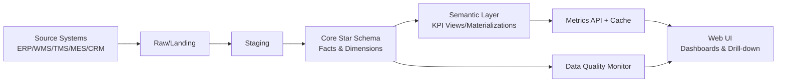

# Supply Chain Control Tower (Reporting-Only) — Product + Technical Spec (v1)

> **Goal:** Kurumsal seviyede, “kontrol kulesi” hissi veren; **tamamen raporlama/analitik** odaklı, okunabilir ve denetlenebilir bir tedarik zinciri raporlama uygulaması.

---

## 1) Executive Summary

Bu uygulama; ERP/WMS/TMS/MES/CRM gibi sistemlerden gelen veriyi bir araya getirerek:
- **Tek versiyon gerçek** yaklaşımıyla KPI’ları standartlaştırır,
- Yönetici panoları + drill-down + exception cockpit sağlar,
- Veri kalitesini ve veri tazeliğini görünür kılar,
- Yetkilendirme, denetim izi ve kurumsal yönetişim beklentilerini karşılar.

**Sınır:** Operasyonel sistemlerde işlem yaratmaz. **Write-back yok.**

---

## 2) Scope

### In-Scope (MVP)
- 8–12 adet standart dashboard (Exec, Plan, Source, Make, Deliver, Finance-view)
- Global filtreler (tarih, şirket/tesis, müşteri segmenti, ürün hiyerarşisi, kanal)
- Drill-down (tile → trend → driver → detay tablo)
- KPI Catalog (tanım, formül, owner, refresh SLA, grain, source)
- Export (CSV + PDF) — en az 3 dashboard
- Data Quality Monitor (freshness, completeness, reconciliation)
- RBAC + Audit Log + Row-level security yaklaşımı (MVP’de logical)

### Out-of-Scope (şimdilik)
- Sipariş/PO/üretim emri yaratma
- Otomatik aksiyon tetikleme (RPA/Workflow)
- Tam kapsamlı predictive / prescriptive optimization (ML/OR)
- Master data authoring (MDM) — sadece referans okuma

---

## 3) Personas & Usage

### Personas
1) **CEO/GM:** 5 dk’da “ne oluyor?” + risk/exception
2) **SC Director:** OTIF, stok, kapasite, tedarik riski
3) **Planner:** tahmin doğruluğu, backlog, kapasite, plan-sapma
4) **Procurement:** supplier OT, lead time variance, PPM, spend
5) **Logistics:** transit time, carrier OT, freight cost, disruptions
6) **Finance Controller:** working capital proxy, cash-to-cash proxy, margin proxy

### Top Jobs-to-be-done
- “OTIF düştü — nerede, hangi müşteri/ürün, neden?”
- “Stok arttı ama servis düşüyor — aging ve excess nerede?”
- “Kapasite dolu görünüyor — plan ile gerçekleşen sapması ne?”
- “Tedarikçi gecikmesi mi, üretim mi, lojistik mi en büyük driver?”

---

## 4) North Star Metrics

- Time-to-Insight: kritik KPI sapmasını **< 60 saniyede** root-cause driver’a indir
- Data Trust: dashboard’ların %95’inde “freshness SLA” yeşil
- Adoption: haftalık aktif kullanıcı oranı (WAU/MAU) > %50 (hedef)

---

## 5) Information Architecture (Navigation)

1. **Command Center (Home)**
   - KPI tiles (OTIF, Backlog, DOH, Schedule Adherence, Supplier OT, Freight)
   - Exception feed (top 10 sapma)
   - “Why?” panel (top driver decomposition)

2. **Plan (Demand & Forecast)**
   - Forecast Accuracy (WAPE/MAPE), Bias
   - Demand waterfall (baseline vs overrides)
   - Backlog trend

3. **Source (Procurement)**
   - Supplier OT, lead time variance, PPM
   - PO aging, open POs
   - Spend overview (proxy)

4. **Make (Production)**
   - Schedule adherence, capacity utilization
   - WIP & bottleneck view (proxy)
   - Quality yield (proxy)

5. **Deliver (Logistics)**
   - Shipments OT, transit time variance
   - Freight cost/unit, carrier performance
   - Incoterm/channel breakdown (varsa)

6. **Inventory (Core)**
   - On-hand, in-transit, aging, E&O
   - Safety stock coverage, stockout

7. **Data Quality & Lineage**
   - Freshness dashboard
   - Reconciliation checks
   - Source coverage matrix

8. **KPI Catalog**
   - KPI list + owner + formula + grain + refresh + source tables
   - “Used in dashboards” backlinks

---

## 6) Data Architecture

### 6.1 Source Systems (logical)
- ERP: Orders, POs, Items, BOM, costs (proxy)
- WMS: inventory, movements, locations
- MES: production confirmations, downtime (proxy)
- TMS: shipments, costs, transit times
- CRM: customer master, segments
- SRM/QMS: supplier quality metrics

> MVP’de kaynaklar **CSV/Excel** veya mock API ile simüle edilebilir.

### 6.2 Target Architecture (recommended)
- **Landing / Raw**: kaynaktan 1:1 ham tablo (immutable)
- **Staging**: tip dönüşümü, keys, basic cleaning
- **Core (Star Schema)**: facts + dimensions
- **Semantic Layer**: KPI view/materialized view + metric catalog

### 6.3 Star Schema (minimum)

**Dimensions**
- dim_date (day/week/month, fiscal)
- dim_org (company, plant, DC, region)
- dim_product (family, category, SKU, UoM)
- dim_customer (segment, channel, geography)
- dim_supplier
- dim_carrier
- dim_lane (origin-destination)

**Facts**
- fact_orders (order line grain)
- fact_shipments (shipment line)
- fact_inventory_snapshot (daily SKU-location)
- fact_production (daily workcenter/product)
- fact_purchase_orders (PO line)
- fact_forecast (time bucket + product + org)

---

## 7) KPI Catalog Standard (Template)

Her KPI için aşağıdaki alanlar zorunlu:

- **KPI_ID**: OTIF_001
- **Name**: OTIF %
- **Owner**: Supply Chain Director
- **Business Question**: “Doğru ürün, doğru zamanda, doğru miktarda mı?”
- **Formula (business)**: Delivered On Time AND In Full / Total Delivered
- **Grain**: order_line / week / org / customer / product
- **Dimensions**: org, customer, product, date
- **Refresh SLA**: daily 06:00
- **Source of Truth**: fact_orders + fact_shipments
- **Quality Checks**: completeness, duplicates, key integrity
- **Drill Paths**: org→site→SKU, customer→order, lane→carrier
- **Thresholds**: green/yellow/red

---

## 8) KPI Examples (MVP)

### 8.1 Service
- **OTIF %**
- **OTD %**
- **Fill Rate %**
- **Backlog (qty/value)**

### 8.2 Inventory
- **DOH** (Days on Hand)
- **Inventory Turns**
- **Stockout Rate**
- **Aging buckets** (0–30 / 31–60 / 61–90 / 90+)
- **Excess & Obsolete (E&O)** (policy-based proxy)

### 8.3 Planning
- **Forecast Accuracy** (WAPE/MAPE)
- **Forecast Bias** (signed error)

### 8.4 Production
- **Schedule Adherence %**
- **Capacity Utilization %**
- **Throughput (proxy)**

### 8.5 Procurement
- **Supplier On-Time %**
- **Lead Time Variance**
- **Supplier Quality PPM**

### 8.6 Logistics
- **Freight Cost / Unit**
- **Transit Time Variance**
- **Carrier On-Time %**

### 8.7 Finance (Reporting View)
- **Working Capital (proxy)** = Inventory value + AR − AP (data varsa)
- **Cash-to-Cash (proxy)** = DIO + DSO − DPO (data varsa)

---

## 9) API Design (Reporting)

### Principles
- Read-only endpoints
- Metric-first API: aynı endpoint farklı dims ile çalışır
- Caching: query key bazlı (org/date/filters)

### Endpoints (sample)
- `GET /api/metrics` → catalog list
- `GET /api/metrics/{kpiId}` → definition + metadata
- `POST /api/query` → {kpiId, grain, dims, filters, timeRange} → series + table
- `GET /api/dimensions/{dimName}` → members (for filters)
- `GET /api/health/freshness` → last load timestamps + SLA status
- `GET /api/audit` → last actions (read/export) (admin)

---

## 10) Security & Governance

### RBAC Roles (baseline)
- **ADMIN**: user/role mgmt, config, audit
- **EXEC**: all dashboards, no raw data export
- **MANAGER**: dashboards + CSV export
- **ANALYST**: deeper drill + ad-hoc query builder
- **VIEWER**: read-only standard dashboards

### Row-Level Security (RLS)
- `user_org_access` tablosu (user ↔ org node)
- API her query’de org scope’u enforce eder
- UI filter seçenekleri yetkiye göre daralır

### Audit
- Login/logout, dashboard view, export, ad-hoc query events
- “Who saw what” raporu (kurumsal)

---

## 11) Data Quality & Reconciliation

### Freshness
- Her fact için `max(load_ts)` ve SLA

### Completeness
- critical fields null rate
- time series gap check (missing days/weeks)

### Reconciliation
- ERP Orders vs Shipments (count/value tolerance)
- Inventory snapshot vs movements (delta checks)

### Alerting (reporting-only)
- SLA breach → dashboard banner + optional email webhook (opsiyon)

---

## 12) UI Standards (Enterprise)

- Sidebar navigation + breadcrumb
- KPI tiles: value, delta, target band, confidence indicator
- Drill-down drawer: top contributors (Pareto), filters, export
- Dark/light mode (opsiyon)
- Multi-language hazır: TR/EN i18n keys

---

## 13) Performance & NFR

- P95 Dashboard load < 2.0s (cache)
- P95 API < 500ms (cache)
- 10M+ fact rows için partitioning (date) + indices
- Materialized views for heavy KPIs (OTIF, inventory snapshots)

---

## 14) Delivery Plan (6–8 weeks)

**Week 1–2:** Foundations
- Repo scaffold, auth stub, navigation shell
- Data model + seed demo data
- KPI catalog schema

**Week 3–4:** Metrics + APIs
- dbt models + materializations
- Query API + caching
- 4 core dashboards (Exec, Inventory, Deliver, Source)

**Week 5–6:** Drill-down + Export + Data Quality
- Drill UX + driver decomposition v1
- CSV/PDF export
- Freshness/completeness/reconciliation

**Week 7–8:** Hardening
- RBAC matrix, audit, RLS enforcement
- Tests, CI, performance checks, docs

---

## 15) Appendix A — Tables (DDL Sketch)

```sql
-- App security
create table app_user (
  user_id uuid primary key,
  email text unique not null,
  display_name text,
  created_at timestamptz default now()
);

create table app_role (
  role_id text primary key
);

create table app_user_role (
  user_id uuid references app_user(user_id),
  role_id text references app_role(role_id),
  primary key (user_id, role_id)
);

create table user_org_access (
  user_id uuid references app_user(user_id),
  org_id text not null,
  primary key (user_id, org_id)
);

-- KPI catalog
create table kpi_catalog (
  kpi_id text primary key,
  name text not null,
  owner text not null,
  business_question text,
  formula_business text,
  grain text,
  refresh_sla text,
  source_tables text,
  thresholds jsonb,
  created_at timestamptz default now()
);
```

---

## 16) Appendix B — Dashboard Spec Template (YAML)

```yaml
id: exec_command_center
title: Command Center
filters:
  - date_range
  - org
  - product_family
  - customer_segment
tiles:
  - kpi_id: OTIF_001
    viz: kpi_tile
    target: 0.95
  - kpi_id: DOH_010
    viz: kpi_tile
charts:
  - kpi_id: OTIF_001
    viz: line
    grain: week
  - kpi_id: BACKLOG_002
    viz: stacked_bar
    dims: [org, customer_segment]
drilldowns:
  - from: OTIF_001
    to: otif_root_cause
exports:
  - csv
  - pdf
```

---

## 17) Appendix C — Mermaid Architecture Diagram


